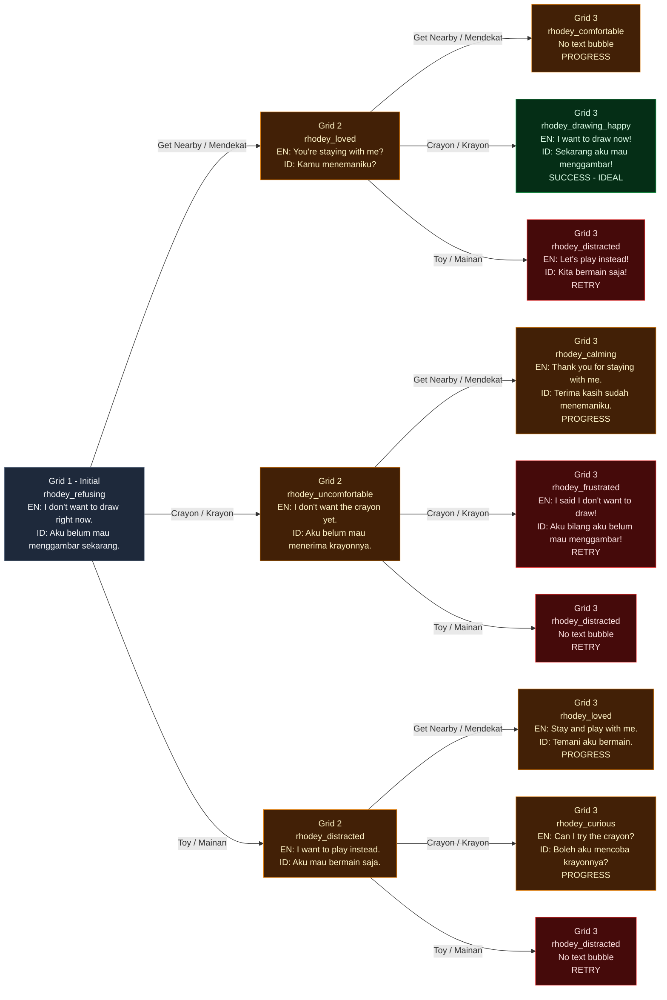

## Chapter 1: Make Rhodey Want to Draw

| Character | Personality | Gender |
| --------- | ----------- | ------ |
| Jojo      | Hyperactive | M      |
| Rhodey    | Tantrum     | M      |
| Timmy     | Shy         | F      |

> **Overview**
>
> Character: Rhodey  
> Grid: 3  
> Choice Grid: 2  
> Actions:
> - Get Nearby
> - Crayon
> - Toy

**Synopsis**: Rhodey is playing near a piece of cardboard and does not want to draw. The player needs to get nearby first so Rhodey feels noticed and loved, then give him a crayon.

### Artist Drawing List

**Rhodey Expressions: 9 drawings**

| Asset ID | Visual Direction |
| --- | --- |
| `rhodey_refusing` | Refuses to draw; closed posture and turns away from the cardboard |
| `rhodey_loved` | Feels noticed and loved; relaxed posture and warm expression |
| `rhodey_uncomfortable` | Receives the crayon too early; hesitant and uncomfortable |
| `rhodey_distracted` | Focuses on playing instead of drawing |
| `rhodey_comfortable` | Calm and comfortable, but not drawing yet |
| `rhodey_drawing_happy` | Happily draws on the cardboard with a crayon |
| `rhodey_calming` | Starts calming down after being approached |
| `rhodey_frustrated` | Frustrated because the crayon is offered repeatedly |
| `rhodey_curious` | Curious about the crayon and considers trying it |

**Actions: 3 drawings**

| Asset ID            | Visual Direction                                         |
| ------------------- | -------------------------------------------------------- |
| `action_get_nearby` | A friendly figure moving closer or sitting beside Rhodey |
| `action_crayon`     | One clearly recognizable drawing crayon                  |
| `action_toy`        | Rhodey's simple, recognizable favorite toy               |

**Backgrounds: 1 drawing**

| Asset ID | Used In | Visual Direction |
| --- | --- | --- |
| `background_classroom` | Grid 1, Grid 2, Grid 3 | A classroom interior with a clear central area for Rhodey, the cardboard, and text bubbles |
