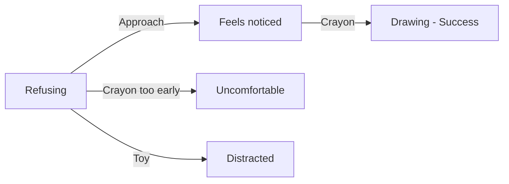

## Chapter 1: Make Rhodey Want to Draw

> **Overview**
>
> Character: Rhodey  
> Grid: 3  
> Choice Slots: 2  
> Possibilities: 9

**Synopsis**: Rhodey does not want to draw. Approach first so he feels noticed, then offer a crayon.

### Grid & Choice Slot Breakdown

A **grid** is one story frame. The grid count includes the final result frame. A **choice slot** is one place where the player must drop an action; one interactive grid may contain more than one slot.

| Grid | Role | Choice Slots | Slot Target | Completion Rule |
| --- | --- | ---: | --- | --- |
| Grid 1 | Interactive | 1 | Scene (general slot) | One action completes this grid and reveals Grid 2. |
| Grid 2 | Interactive | 1 | Scene (general slot) | One action completes this grid and reveals Grid 3. |
| Grid 3 | Result | 0 | None | Shows the final result; no action can be dropped. |

**Possibility formula:** 3 × 3 = 9 outcomes (3 actions across 2 slots). Every slot accepts any chapter action, and actions may be repeated in later slots.

### Actions

- Approach / Dekati
- Crayon / Krayon
- Toy / Mainan

### Ideal Path

Approach → Crayon

### Artist Drawing List

**General Character Expressions: 4 drawings**

| Asset ID | Visual Direction |
| --- | --- |
| `rhodey_calm` | Rhodey: Calm breathing, relaxed shoulders, and a settled expression. |
| `rhodey_frustrated` | Rhodey: Frustrated expression with tense shoulders and an impatient posture. |
| `rhodey_happy` | Rhodey: Open happy expression with an easy smile and positive body language. |
| `rhodey_questioning` | Rhodey: Head tilted with raised brows, showing confusion or questioning an unclear action. |

**Unique Scene Poses: 1 drawings**

| Asset ID | Visual Direction |
| --- | --- |
| `rhodey_drawing` | Rhodey seated and drawing; the crayon and drawing surface are included in this complete image. |

**Actions: 3 drawings**

| Asset ID | Visual Direction |
| --- | --- |
| `action_approach` | A calm caregiver moving closer at the child's eye level with open, non-threatening body language. |
| `action_crayon` | One clearly recognizable drawing crayon with a simple silhouette. |
| `action_toy` | A small, friendly cat toy that reads clearly at card size. |

**Backgrounds: 1 drawing**

| Asset ID | Used In | Visual Direction |
| --- | --- | --- |
| `background_classroom` | Grid 1–3 | A warm classroom with drawing supplies, clear floor space for characters, and quiet areas for text bubbles. |
