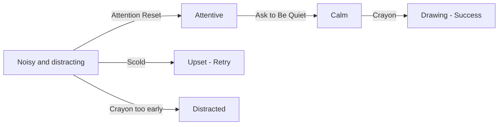

## Chapter 2: Help Jojo Settle Down and Draw

> **Overview**
>
> Story: 1  
> Characters: Jojo, Rhodey  
> Grid: 4  
> Choice Grid: 3  
> Possibilities: 64

**Synopsis**: Jojo is noisy and distracts Rhodey. Reset his attention, ask him to be quiet, then offer a crayon.

### Actions

- Ask to Be Quiet / Minta Tenang
- Scold / Marahi
- Attention Reset / Atur Ulang Perhatian
- Crayon / Krayon

### Ideal Path

Attention Reset → Ask to Be Quiet → Crayon

### Artist Drawing List

**General Character Expressions: 9 drawings**

| Asset ID | Visual Direction |
| --- | --- |
| `jojo_angry` | Jojo: Angry expression with tense brows and firm, closed body language. |
| `jojo_calm` | Jojo: Calm breathing, relaxed shoulders, and a settled expression. |
| `jojo_frustrated` | Jojo: Frustrated expression with tense shoulders and an impatient posture. |
| `jojo_happy` | Jojo: Open happy expression with an easy smile and positive body language. |
| `jojo_neutral` | Jojo: Relaxed neutral posture that can support listening, waiting, or ordinary conversation. |
| `jojo_questioning` | Jojo: Head tilted with raised brows, showing confusion or questioning an unclear action. |
| `rhodey_calm` | Rhodey: Calm breathing, relaxed shoulders, and a settled expression. |
| `rhodey_neutral` | Rhodey: Relaxed neutral posture that can support listening, waiting, or ordinary conversation. |
| `rhodey_questioning` | Rhodey: Head tilted with raised brows, showing confusion or questioning an unclear action. |

**Unique Scene Poses: 2 drawings**

| Asset ID | Visual Direction |
| --- | --- |
| `jojo_drawing` | Jojo seated and drawing; the crayon and drawing surface are included in this complete image. |
| `rhodey_drawing` | Rhodey seated and drawing; the crayon and drawing surface are included in this complete image. |

**Actions: 4 drawings**

| Asset ID | Visual Direction |
| --- | --- |
| `action_ask_quiet` | A gentle quiet gesture with one finger near the mouth and a relaxed expression. |
| `action_scold` | A tense pointing gesture and raised voice marks showing an unhelpful reprimand. |
| `action_attention_reset` | Two hands clapping once to regain attention without intimidating the child. |
| `action_crayon` | One clearly recognizable drawing crayon with a simple silhouette. |

**Backgrounds: 1 drawing**

| Asset ID | Used In | Visual Direction |
| --- | --- | --- |
| `background_classroom` | Grid 1–4 | A warm classroom with drawing supplies, clear floor space for characters, and quiet areas for text bubbles. |
