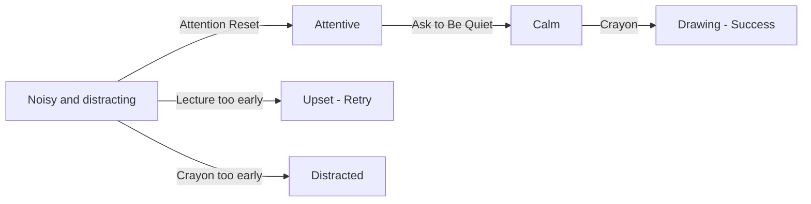

## Chapter 2: Too Loud to Draw

> **Overview**
>
> Full Title: Help Jojo Settle Down and Draw  
> Characters: Jojo, Rhodey  
> Grid: 4  
> Choice Slots: 3  
> Actions: 4  
> Possibilities: 64

### Description

Jojo is full of energy during drawing time and his noise makes it hard for Rhodey to focus. The scene is about helping Jojo shift from active play into a calmer classroom activity.

### Hints

- Children often need attention before they can process an instruction.

### After Chapter Completion

Jojo's energy needed somewhere to go before an instruction could reach him. Getting his attention gently made the request possible.

**Tip:** Get a distracted child's attention first, with a clap or their name, before asking for anything. Then the instruction has a chance to land.

### Grid & Choice Slot Breakdown

A **grid** is one story frame. The grid count includes the final result frame. A **choice slot** is one place where the player must drop an action; one interactive grid may contain more than one slot.

| Grid | Role | Choice Slots | Slot Target | Completion Rule |
| --- | --- | ---: | --- | --- |
| Grid 1 | Interactive | 1 | Scene (general slot) | One action completes this grid and reveals Grid 2. |
| Grid 2 | Interactive | 1 | Scene (general slot) | One action completes this grid and reveals Grid 3. |
| Grid 3 | Interactive | 1 | Scene (general slot) | One action completes this grid and reveals Grid 4. |
| Grid 4 | Result | 0 | None | Shows the final result; no action can be dropped. |

**Possibility formula:** 4 × 4 × 4 = 64 outcomes (4 actions across 3 slots). Every slot accepts any chapter action, and actions may be repeated in later slots.

### Actions

- Ask to Be Quiet / Minta Tenang
- Lecture / Tegur
- Attention Reset / Atur Ulang Perhatian
- Crayon / Krayon

### Developer Mermaid

### Artist Drawing List

**General Character Expressions: 9 drawings**

| Asset ID | Visual Direction |
| --- | --- |
| `jojo_angry` | Jojo: Angry expression with tense brows and firm, closed body language. |
| `jojo_calm` | Jojo: Calm breathing, relaxed shoulders, and a settled expression. |
| `jojo_frustrated` | Jojo: Frustrated expression with tense shoulders and an impatient posture. |
| `jojo_happy` | Jojo: Open happy expression with an easy smile and positive body language. |
| `jojo_neutral` | Jojo: Relaxed neutral posture that can support listening, waiting, or ordinary conversation. |
| `jojo_questioning` | Jojo: Head tilted with raised brows, showing confusion or questioning an unclear action. |
| `rhodey_calm` | Rhodey: Calm breathing, relaxed shoulders, and a settled expression. |
| `rhodey_neutral` | Rhodey: Relaxed neutral posture that can support listening, waiting, or ordinary conversation. |
| `rhodey_questioning` | Rhodey: Head tilted with raised brows, showing confusion or questioning an unclear action. |

**Unique Scene Poses: 2 drawings**

| Asset ID | Visual Direction |
| --- | --- |
| `jojo_drawing` | Jojo seated and drawing; the crayon and drawing surface are included in this complete image. |
| `rhodey_drawing` | Rhodey seated and drawing; the crayon and drawing surface are included in this complete image. |

**Actions: 4 drawings**

| Asset ID | Visual Direction |
| --- | --- |
| `action_ask_quiet` | A gentle quiet gesture with one finger near the mouth and a relaxed expression. |
| `action_lecture` | A firm but calm corrective gesture, without yelling or intimidating body language. |
| `action_attention_reset` | Two hands clapping once to regain attention without intimidating the child. |
| `action_crayon` | One clearly recognizable drawing crayon with a simple silhouette. |

**Backgrounds: 1 drawing**

| Asset ID | Used In | Visual Direction |
| --- | --- | --- |
| `background_classroom` | Grid 1–4 | A warm classroom with drawing supplies, clear floor space for characters, and quiet areas for text bubbles. |
