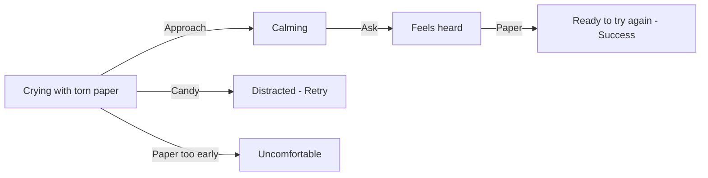

## Chapter 3: Help Rhodey After His Paper Tears

> **Overview**
>
> Story: 1  
> Character: Rhodey  
> Grid: 4  
> Choice Grid: 3  
> Possibilities: 64

**Synopsis**: Rhodey's drawing paper tears and he cries. Approach, ask what happened, then give him replacement paper.

### Actions

- Approach / Dekati
- Ask / Tanya
- Candy / Permen
- Paper / Kertas

### Ideal Path

Approach → Ask → Paper

### Artist Drawing List

**General Character Expressions: 5 drawings**

| Asset ID | Visual Direction |
| --- | --- |
| `rhodey_calm` | Rhodey: Calm breathing, relaxed shoulders, and a settled expression. |
| `rhodey_crying` | Rhodey: Visible tears, trembling mouth, and a distressed crying expression. |
| `rhodey_frustrated` | Rhodey: Frustrated expression with tense shoulders and an impatient posture. |
| `rhodey_questioning` | Rhodey: Head tilted with raised brows, showing confusion or questioning an unclear action. |
| `rhodey_relieved` | Rhodey: Relieved expression with softened eyes and released tension. |

**Unique Scene Poses: 2 drawings**

| Asset ID | Visual Direction |
| --- | --- |
| `rhodey_crying_torn_paper` | Rhodey crying while holding two visibly torn pieces of his drawing paper. |
| `rhodey_holding_new_paper` | Rhodey happily holding one clean replacement sheet, ready to draw again. |

**Actions: 4 drawings**

| Asset ID | Visual Direction |
| --- | --- |
| `action_approach` | A calm caregiver moving closer at the child's eye level with open, non-threatening body language. |
| `action_asking` | A calm question bubble and attentive listening gesture. |
| `action_candy` | A small wrapped candy with a distinct silhouette. |
| `action_paper` | A clean replacement sheet of drawing paper. |

**Backgrounds: 1 drawing**

| Asset ID | Used In | Visual Direction |
| --- | --- | --- |
| `background_classroom` | Grid 1–4 | A warm classroom with drawing supplies, clear floor space for characters, and quiet areas for text bubbles. |
