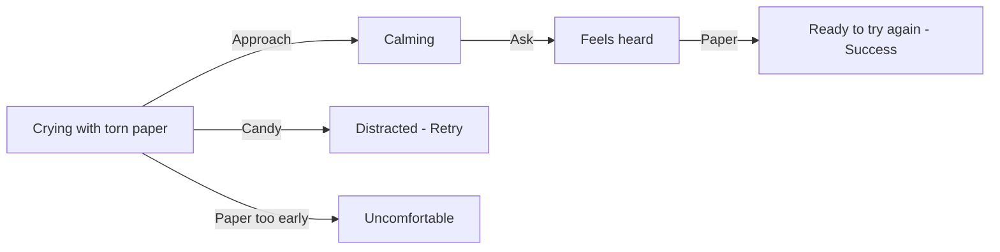

## Chapter 3: Help Rhodey After His Paper Tears

> **Overview**
>
> Character: Rhodey  
> Grid: 4  
> Choice Slots: 3  
> Actions: 4  
> Possibilities: 64

### Description

Rhodey's drawing paper tears during class and the broken drawing feels important to him. He is upset not only because the paper is damaged, but because the work he cared about suddenly feels lost.

### Hints

- A distressed child may need calm presence before they can explain what happened.
- Problem solving lands better after the child feels heard.
- A treat can distract from the feeling without repairing the actual problem.

### Grid & Choice Slot Breakdown

A **grid** is one story frame. The grid count includes the final result frame. A **choice slot** is one place where the player must drop an action; one interactive grid may contain more than one slot.

| Grid | Role | Choice Slots | Slot Target | Completion Rule |
| --- | --- | ---: | --- | --- |
| Grid 1 | Interactive | 1 | Scene (general slot) | One action completes this grid and reveals Grid 2. |
| Grid 2 | Interactive | 1 | Scene (general slot) | One action completes this grid and reveals Grid 3. |
| Grid 3 | Interactive | 1 | Scene (general slot) | One action completes this grid and reveals Grid 4. |
| Grid 4 | Result | 0 | None | Shows the final result; no action can be dropped. |

**Possibility formula:** 4 × 4 × 4 = 64 outcomes (4 actions across 3 slots). Every slot accepts any chapter action, and actions may be repeated in later slots.

### Actions

- Approach / Dekati
- Ask / Tanya
- Candy / Permen
- Paper / Kertas

### Developer Mermaid

### Artist Drawing List

**General Character Expressions: 5 drawings**

| Asset ID | Visual Direction |
| --- | --- |
| `rhodey_calm` | Rhodey: Calm breathing, relaxed shoulders, and a settled expression. |
| `rhodey_crying` | Rhodey: Visible tears, trembling mouth, and a distressed crying expression. |
| `rhodey_frustrated` | Rhodey: Frustrated expression with tense shoulders and an impatient posture. |
| `rhodey_questioning` | Rhodey: Head tilted with raised brows, showing confusion or questioning an unclear action. |
| `rhodey_relieved` | Rhodey: Relieved expression with softened eyes and released tension. |

**Unique Scene Poses: 2 drawings**

| Asset ID | Visual Direction |
| --- | --- |
| `rhodey_crying_torn_paper` | Rhodey crying while holding two visibly torn pieces of his drawing paper. |
| `rhodey_holding_new_paper` | Rhodey happily holding one clean replacement sheet, ready to draw again. |

**Actions: 4 drawings**

| Asset ID | Visual Direction |
| --- | --- |
| `action_approach` | A calm caregiver moving closer at the child's eye level with open, non-threatening body language. |
| `action_asking` | A calm question bubble and attentive listening gesture. |
| `action_candy` | A small wrapped candy with a distinct silhouette. |
| `action_paper` | A clean replacement sheet of drawing paper. |

**Backgrounds: 1 drawing**

| Asset ID | Used In | Visual Direction |
| --- | --- | --- |
| `background_classroom` | Grid 1–4 | A warm classroom with drawing supplies, clear floor space for characters, and quiet areas for text bubbles. |
