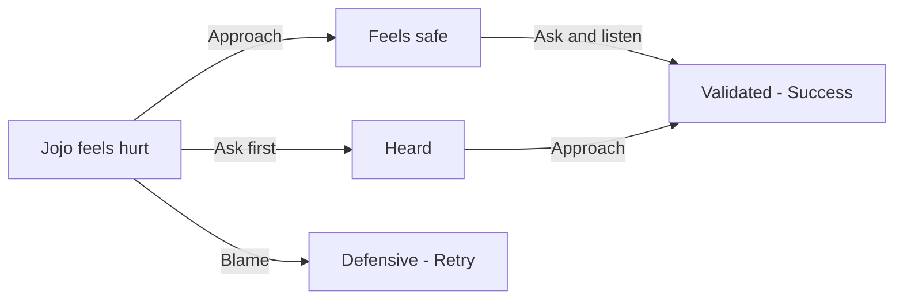

## Chapter 1: That Hurt My Feelings

> **Overview**
>
> Full Title: Validate Jojo's Feelings  
> Characters: Jojo, Rhodey  
> Grid: 3  
> Choice Slots: 2  
> Actions: 3  
> Possibilities: 9  
> Maximum Placements: 8

### Description

Jojo feels hurt in the playground after Rhodey says something unkind. The conflict is still small, but Jojo needs his feelings to be taken seriously before he can move on.

### Hints

- Validation starts by making the child feel safe enough to speak.

### After Chapter Completion

Jojo needed his feelings taken seriously before anything else. Feeling safe enough to speak came first.

**Tip:** When a child gets hurt by another child, validate the feeling before sorting out who did what. That safety makes it possible to talk.

### Challenge & Stars

The player can make at most **8 accepted placements or replacements**. Reaching a successful outcome on the final allowed placement still completes the chapter. Otherwise, show: “Jojo and Rhodey are tired. You took too long.”

The face indicator changes with the current placement range. Stars are awarded only after success:

- **Green face — 3 stars:** 0–3 placements
- **Yellow face — 2 stars:** 4–5 placements
- **Orange face — 1 star:** 6–8 placements when the chapter succeeds
- **Red face — chapter ends without stars:** 8 placements without a successful outcome

### Grid & Choice Slot Breakdown

A **grid** is one story frame. The grid count includes the final result frame. A **choice slot** is one place where the player must drop an action; one interactive grid may contain more than one slot.

| Grid | Role | Choice Slots | Slot Target | Completion Rule |
| --- | --- | ---: | --- | --- |
| Grid 1 | Interactive | 1 | Scene (general slot) | One action completes this grid and reveals Grid 2. |
| Grid 2 | Interactive | 1 | Scene (general slot) | One action completes this grid and reveals Grid 3. |
| Grid 3 | Result | 0 | None | Shows the final result; no action can be dropped. |

**Possibility formula:** 3 × 3 = 9 outcomes (3 actions across 2 slots). Every slot accepts any chapter action, and actions may be repeated in later slots.

### Actions

- Ask / Tanya
- Blame / Menyalahkan
- Approach / Dekati

### Developer Mermaid

### Artist Drawing List

**General Character Expressions: 8 drawings**

| Asset ID | Visual Direction |
| --- | --- |
| `jojo_calm` | Jojo: Calm breathing, relaxed shoulders, and a settled expression. |
| `jojo_defensive` | Jojo: Guarded posture with crossed arms or pulled-back shoulders. |
| `jojo_relieved` | Jojo: Relieved expression with softened eyes and released tension. |
| `jojo_sad` | Jojo: Lowered ears and gaze with a clearly sad but not crying expression. |
| `rhodey_defensive` | Rhodey: Guarded posture with crossed arms or pulled-back shoulders. |
| `rhodey_neutral` | Rhodey: Relaxed neutral posture that can support listening, waiting, or ordinary conversation. |
| `rhodey_questioning` | Rhodey: Head tilted with raised brows, showing confusion or questioning an unclear action. |
| `rhodey_sad` | Rhodey: Lowered ears and gaze with a clearly sad but not crying expression. |

**Unique Scene Poses: 0 drawings**

| Asset ID | Visual Direction |
| --- | --- |
| — | No unique pose required in this chapter. |

**Actions: 3 drawings**

| Asset ID | Visual Direction |
| --- | --- |
| `action_asking` | A calm question bubble and attentive listening gesture. |
| `action_blaming` | An accusatory pointing gesture with a sharp question mark to show judgment before listening. |
| `action_approach` | A calm caregiver moving closer at the child's eye level with open, non-threatening body language. |

**Backgrounds: 1 drawing**

| Asset ID | Used In | Visual Direction |
| --- | --- | --- |
| `background_playground` | Grid 1–3 | A friendly outdoor playground with a slide, soft ground, open character space, and room for text bubbles. |
