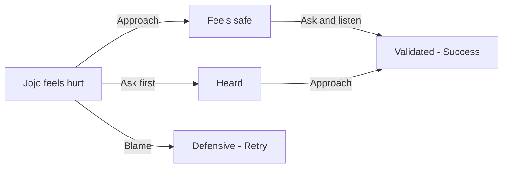

## Chapter 1: Validate Jojo's Feelings

> **Overview**
>
> Story: 2  
> Characters: Jojo, Rhodey  
> Grid: 3  
> Choice Grid: 2  
> Possibilities: 9

**Synopsis**: Jojo is upset after Rhodey calls him a hurtful name. Approach Jojo, then ask and listen to how he feels.

### Actions

- Ask / Tanya
- Blame / Menyalahkan
- Approach / Dekati

### Ideal Path

Approach → Ask

### Artist Drawing List

**General Character Expressions: 8 drawings**

| Asset ID | Visual Direction |
| --- | --- |
| `jojo_calm` | Jojo: Calm breathing, relaxed shoulders, and a settled expression. |
| `jojo_defensive` | Jojo: Guarded posture with crossed arms or pulled-back shoulders. |
| `jojo_relieved` | Jojo: Relieved expression with softened eyes and released tension. |
| `jojo_sad` | Jojo: Lowered ears and gaze with a clearly sad but not crying expression. |
| `rhodey_defensive` | Rhodey: Guarded posture with crossed arms or pulled-back shoulders. |
| `rhodey_neutral` | Rhodey: Relaxed neutral posture that can support listening, waiting, or ordinary conversation. |
| `rhodey_questioning` | Rhodey: Head tilted with raised brows, showing confusion or questioning an unclear action. |
| `rhodey_sad` | Rhodey: Lowered ears and gaze with a clearly sad but not crying expression. |

**Unique Scene Poses: 0 drawings**

| Asset ID | Visual Direction |
| --- | --- |
| — | No unique pose required in this chapter. |

**Actions: 3 drawings**

| Asset ID | Visual Direction |
| --- | --- |
| `action_asking` | A calm question bubble and attentive listening gesture. |
| `action_blaming` | An accusatory pointing gesture with a sharp question mark to show judgment before listening. |
| `action_approach` | A calm caregiver moving closer at the child's eye level with open, non-threatening body language. |

**Backgrounds: 1 drawing**

| Asset ID | Used In | Visual Direction |
| --- | --- | --- |
| `background_playground` | Grid 1–3 | A friendly outdoor playground with a slide, soft ground, open character space, and room for text bubbles. |
