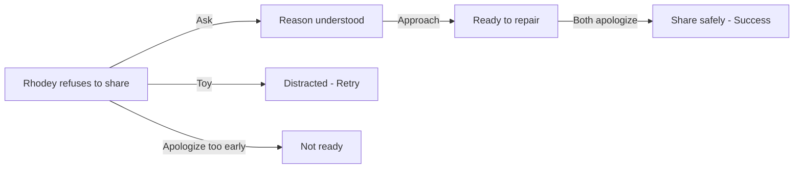

## Chapter 2: Help Rhodey Share the Slide

> **Overview**
>
> Characters: Jojo, Rhodey  
> Grid: 4  
> Choice Slots: 3  
> Possibilities: 64

**Synopsis**: Rhodey refuses to share the slide with Jojo. Ask why, approach calmly, then help both children apologize.

### Grid & Choice Slot Breakdown

A **grid** is one story frame. The grid count includes the final result frame. A **choice slot** is one place where the player must drop an action; one interactive grid may contain more than one slot.

| Grid | Role | Choice Slots | Slot Target | Completion Rule |
| --- | --- | ---: | --- | --- |
| Grid 1 | Interactive | 1 | Scene (general slot) | One action completes this grid and reveals Grid 2. |
| Grid 2 | Interactive | 1 | Scene (general slot) | One action completes this grid and reveals Grid 3. |
| Grid 3 | Interactive | 1 | Scene (general slot) | One action completes this grid and reveals Grid 4. |
| Grid 4 | Result | 0 | None | Shows the final result; no action can be dropped. |

**Possibility formula:** 4 × 4 × 4 = 64 outcomes (4 actions across 3 slots). Every slot accepts any chapter action, and actions may be repeated in later slots.

### Actions

- Ask / Tanya
- Toy / Mainan
- Approach / Dekati
- Apologize / Minta Maaf

### Ideal Path

Ask → Approach → Apologize

### Artist Drawing List

**General Character Expressions: 8 drawings**

| Asset ID | Visual Direction |
| --- | --- |
| `jojo_calm` | Jojo: Calm breathing, relaxed shoulders, and a settled expression. |
| `jojo_neutral` | Jojo: Relaxed neutral posture that can support listening, waiting, or ordinary conversation. |
| `jojo_questioning` | Jojo: Head tilted with raised brows, showing confusion or questioning an unclear action. |
| `jojo_sad` | Jojo: Lowered ears and gaze with a clearly sad but not crying expression. |
| `rhodey_angry` | Rhodey: Angry expression with tense brows and firm, closed body language. |
| `rhodey_calm` | Rhodey: Calm breathing, relaxed shoulders, and a settled expression. |
| `rhodey_neutral` | Rhodey: Relaxed neutral posture that can support listening, waiting, or ordinary conversation. |
| `rhodey_questioning` | Rhodey: Head tilted with raised brows, showing confusion or questioning an unclear action. |

**Unique Scene Poses: 1 drawings**

| Asset ID | Visual Direction |
| --- | --- |
| `jojo_rhodey_handshake` | One combined illustration of Jojo and Rhodey facing each other and shaking paws after a mutual apology. |

**Actions: 4 drawings**

| Asset ID | Visual Direction |
| --- | --- |
| `action_asking` | A calm question bubble and attentive listening gesture. |
| `action_toy` | A small, friendly cat toy that reads clearly at card size. |
| `action_approach` | A calm caregiver moving closer at the child's eye level with open, non-threatening body language. |
| `action_apologize` | Two paws meeting in a mutual apology and reconciliation gesture. |

**Backgrounds: 1 drawing**

| Asset ID | Used In | Visual Direction |
| --- | --- | --- |
| `background_playground` | Grid 1–4 | A friendly outdoor playground with a slide, soft ground, open character space, and room for text bubbles. |
