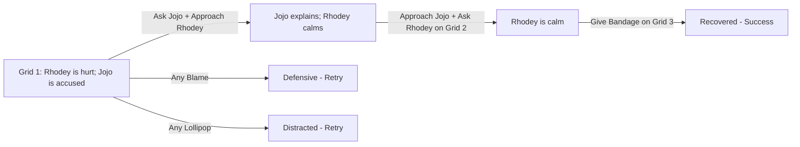

## Chapter 3: Jojo Pushed Me!

> **Overview**
>
> Full Title: Listen Before Helping Rhodey  
> Characters: Jojo, Rhodey  
> Grid: 4  
> Choice Slots: 5  
> Actions: 5  
> Possibilities: 3125  
> Maximum Placements: 30

### Description

Rhodey falls in the playground and says Jojo pushed him. Rhodey is hurt and crying, while Jojo looks shocked by the accusation. The scene asks the player to handle injury, emotion, and fairness at the same time.

### Hints

- When two children are involved, emotional safety and fairness need to move together.

### After Chapter Completion

Rhodey was hurt and Jojo was accused, and both needed attention at the same time. Comfort and fairness had to happen together.

**Tip:** When two children are upset at once, calm the hurt one and listen to both sides without blame. Fix what's broken after that.

### Challenge & Stars

The player can make at most **30 accepted placements or replacements**. Reaching a successful outcome on the final allowed placement still completes the chapter. Otherwise, show: “Jojo and Rhodey are tired. You took too long.”

The face indicator changes with the current placement range. Stars are awarded only after success:

- **Green face — 3 stars:** 0–8 placements
- **Yellow face — 2 stars:** 9–18 placements
- **Orange face — 1 star:** 19–30 placements when the chapter succeeds
- **Red face — chapter ends without stars:** 30 placements without a successful outcome

### Grid & Choice Slot Breakdown

A **grid** is one story frame. The grid count includes the final result frame. A **choice slot** is one place where the player must drop an action; one interactive grid may contain more than one slot.

| Grid | Role | Choice Slots | Slot Target | Completion Rule |
| --- | --- | ---: | --- | --- |
| Grid 1 | Interactive | 2 | Jojo + Rhodey (one targeted slot each) | Both slots must be filled before Grid 2 appears. |
| Grid 2 | Interactive | 2 | Jojo + Rhodey (one targeted slot each) | Both slots must be filled before Grid 3 appears. |
| Grid 3 | Interactive | 1 | Scene (general slot) | One action completes this grid and reveals Grid 4. |
| Grid 4 | Result | 0 | None | Shows the final result; no action can be dropped. |

**Possibility formula:** 5 × 5 × 5 × 5 × 5 = 3125 outcomes (5 actions across 5 slots). Every slot accepts any chapter action, and actions may be repeated in later slots.

### Actions

- Ask / Tanya
- Blame / Menyalahkan
- Give Bandage / Berikan Plester
- Lollipop / Permen Lolipop
- Approach / Dekati

### Developer Mermaid

### Artist Drawing List

**General Character Expressions: 9 drawings**

| Asset ID | Visual Direction |
| --- | --- |
| `jojo_defensive` | Jojo: Guarded posture with crossed arms or pulled-back shoulders. |
| `jojo_neutral` | Jojo: Relaxed neutral posture that can support listening, waiting, or ordinary conversation. |
| `jojo_questioning` | Jojo: Head tilted with raised brows, showing confusion or questioning an unclear action. |
| `jojo_relieved` | Jojo: Relieved expression with softened eyes and released tension. |
| `jojo_sad` | Jojo: Lowered ears and gaze with a clearly sad but not crying expression. |
| `rhodey_calm` | Rhodey: Calm breathing, relaxed shoulders, and a settled expression. |
| `rhodey_defensive` | Rhodey: Guarded posture with crossed arms or pulled-back shoulders. |
| `rhodey_questioning` | Rhodey: Head tilted with raised brows, showing confusion or questioning an unclear action. |
| `rhodey_relieved` | Rhodey: Relieved expression with softened eyes and released tension. |

**Unique Scene Poses: 2 drawings**

| Asset ID | Visual Direction |
| --- | --- |
| `rhodey_bandaged` | Rhodey with a visible bandage already applied to his knee; a complete image requiring no overlay. |
| `rhodey_injured_sitting` | Rhodey sitting after a fall and holding one scraped knee; usable before first aid is applied. |

**Actions: 5 drawings**

| Asset ID | Visual Direction |
| --- | --- |
| `action_asking` | A calm question bubble and attentive listening gesture. |
| `action_blaming` | An accusatory pointing gesture with a sharp question mark to show judgment before listening. |
| `action_give_bandage` | A clean adhesive bandage held ready for first aid. |
| `action_lollipop` | A round, colorful lollipop on a short stick. |
| `action_approach` | A calm caregiver moving closer at the child's eye level with open, non-threatening body language. |

**Backgrounds: 1 drawing**

| Asset ID | Used In | Visual Direction |
| --- | --- | --- |
| `background_playground` | Grid 1–4 | A friendly outdoor playground with a slide, soft ground, open character space, and room for text bubbles. |
