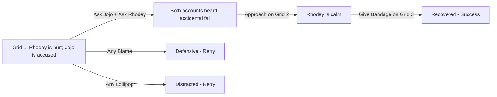

## Chapter 3: Listen Before Helping Rhodey

> **Overview**
>
> Characters: Jojo, Rhodey  
> Grid: 4  
> Choice Slots: 4  
> Possibilities: 625

**Synopsis**: Rhodey falls and says Jojo pushed him. Ask both children, learn that the fall was accidental, approach calmly, then give Rhodey a bandage.

### Grid & Choice Slot Breakdown

A **grid** is one story frame. The grid count includes the final result frame. A **choice slot** is one place where the player must drop an action; one interactive grid may contain more than one slot.

| Grid | Role | Choice Slots | Slot Target | Completion Rule |
| --- | --- | ---: | --- | --- |
| Grid 1 | Interactive | 2 | Jojo + Rhodey (one targeted slot each) | Both slots must be filled before Grid 2 appears. |
| Grid 2 | Interactive | 1 | Scene (general slot) | One action completes this grid and reveals Grid 3. |
| Grid 3 | Interactive | 1 | Scene (general slot) | One action completes this grid and reveals Grid 4. |
| Grid 4 | Result | 0 | None | Shows the final result; no action can be dropped. |

**Possibility formula:** 5 × 5 × 5 × 5 = 625 outcomes (5 actions across 4 slots). Every slot accepts any chapter action, and actions may be repeated in later slots.

### Actions

- Ask / Tanya
- Blame / Menyalahkan
- Give Bandage / Berikan Plester
- Lollipop / Permen Lolipop
- Approach / Dekati

### Ideal Path

Ask + Ask → Approach → Give Bandage

### Artist Drawing List

**General Character Expressions: 9 drawings**

| Asset ID | Visual Direction |
| --- | --- |
| `jojo_defensive` | Jojo: Guarded posture with crossed arms or pulled-back shoulders. |
| `jojo_neutral` | Jojo: Relaxed neutral posture that can support listening, waiting, or ordinary conversation. |
| `jojo_questioning` | Jojo: Head tilted with raised brows, showing confusion or questioning an unclear action. |
| `jojo_relieved` | Jojo: Relieved expression with softened eyes and released tension. |
| `jojo_sad` | Jojo: Lowered ears and gaze with a clearly sad but not crying expression. |
| `rhodey_calm` | Rhodey: Calm breathing, relaxed shoulders, and a settled expression. |
| `rhodey_defensive` | Rhodey: Guarded posture with crossed arms or pulled-back shoulders. |
| `rhodey_questioning` | Rhodey: Head tilted with raised brows, showing confusion or questioning an unclear action. |
| `rhodey_relieved` | Rhodey: Relieved expression with softened eyes and released tension. |

**Unique Scene Poses: 2 drawings**

| Asset ID | Visual Direction |
| --- | --- |
| `rhodey_bandaged` | Rhodey with a visible bandage already applied to his knee; a complete image requiring no overlay. |
| `rhodey_injured_sitting` | Rhodey sitting after a fall and holding one scraped knee; usable before first aid is applied. |

**Actions: 5 drawings**

| Asset ID | Visual Direction |
| --- | --- |
| `action_asking` | A calm question bubble and attentive listening gesture. |
| `action_blaming` | An accusatory pointing gesture with a sharp question mark to show judgment before listening. |
| `action_give_bandage` | A clean adhesive bandage held ready for first aid. |
| `action_lollipop` | A round, colorful lollipop on a short stick. |
| `action_approach` | A calm caregiver moving closer at the child's eye level with open, non-threatening body language. |

**Backgrounds: 1 drawing**

| Asset ID | Used In | Visual Direction |
| --- | --- | --- |
| `background_playground` | Grid 1–4 | A friendly outdoor playground with a slide, soft ground, open character space, and room for text bubbles. |
